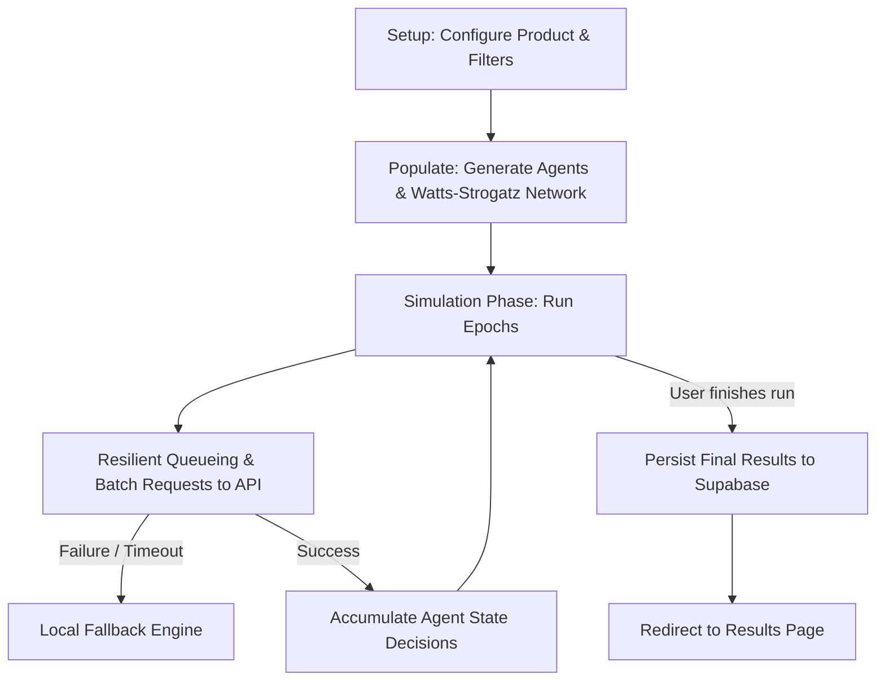

# Simulation Platform: Architecture & State Reference

This document provides a complete technical reference of the simulation platform's state management, data models, routes, API contracts, and lifecycle workflows. Use this guide to reconfigure pages safely without breaking existing features or losing simulation data.

> **Last Updated:** July 10, 2026 | **Status:** Architecture verified against live codebase (lib/, app/api/, app/)

---

## Summary of Key Files

| Module | Path | Purpose |
|--------|------|---------|
| Decision Engine | `lib/prompts.ts:11–114` | `calculateDecision()` — Prospect Theory utility + conviction scoring (single source of truth) |
| Agent Generation | `lib/agentGeneration.ts` | `generateAgents()`, `buildWattsStrogatz()`, `classifyPersona()`, `computeInfluenceScores()` |
| State Management | `lib/SimulationContext.tsx` | Global state (agents, scenarios, adoption curve, branches, LLM logs) |
| Step Execution | `app/api/run-step/route.ts` | Batch decision processing + LLM narrative fallback (OpenRouter free tier) |
| Results Page | `app/results/page.tsx` | Adoption curve chart, persona breakdown, **Retention Risk %**, key agent voices |
| Dashboard | `app/dashboard/page.tsx` | Simulation history, filtering, quick-launch |
| Core Types | `lib/types.ts` | `Agent`, `AgentState`, `StepSnapshot`, `ProductInput`, `MarketFilters` |
| Utilities | `lib/apiGuard.ts`, `lib/productParams.ts` | Auth/rate-limit enforcement, input validation, param derivation |

---

---

## 1. Core State & Data Models

All global simulation states are governed by the `SimulationContext` (defined in [SimulationContext.tsx](file:///d:/codings/strawberry/decision-platform/lib/SimulationContext.tsx)).

### `ProductInput` Schema
Representing the configuration of the product being simulated.
```typescript
export interface ProductInput {
    name: string;
    price: string;
    benefits: string[];
    riskLevel: "low" | "medium" | "high";
    valueProp: "weak" | "moderate" | "strong";
    aiParamOverrides?: Partial<ScenarioParams>;
    category: string;
    competitorDensity: "low" | "medium" | "high";
    switchingCost: "low" | "medium" | "high";
    marketingBudget: "low" | "medium" | "high";
    primaryChannel: "social" | "enterprise_sales" | "retail" | "word_of_mouth";
    painPoints: string[];
    regulatoryRisk: "low" | "medium" | "high";
}
```

### `MarketFilters` Schema
Demographic boundaries used to filter the GSS population database.
```typescript
export interface MarketFilters {
    ageMin: number;
    ageMax: number;
    incomeMin: number;
    incomeMax: number;
    education: string;
    wrkstat: string;
}
```

### `Agent` Schema
Structure of individual behavioral agents generated for the run.
```typescript
export interface Agent {
    id: number;
    name: string;
    age: number;
    job: string;
    persona: "influencer" | "early_adopter" | "skeptic" | "laggard" | string;
    income: number;
    risk: number;       // Risk tolerance score [0, 1]
    trust: number;      // System trust score [0, 1]
    social: number;     // Social network impact factor [0, 1]
    influence_score: number;
    statusQuoBias?: number;
}
```

### `AgentState` & `SimulationStates` Schema
Calculated decision state of each agent during steps.
```typescript
export interface AgentState {
    decision: "support" | "oppose" | "neutral" | null;
    reasoning: string | null;
    step: number | null;
    pending: boolean;
    isSeeded?: boolean;
    model?: string;     // Model tag, e.g. "gpt-4o", "local-resilience-fallback"
}

export type SimulationStates = Record<number, AgentState>;
```

### `StepSnapshot` (Adoption Curve Point)
Recorded snapshot at the end of each simulation epoch.
```typescript
export interface StepSnapshot {
    step: number;
    support: number;
    neutral: number;
    oppose: number;
    pending: number;
}
```

### `LogEntry` Schema
```typescript
export interface LogEntry {
    step: number;
    agentId: number;
    agentName: string;
    persona: string;
    decision: "support" | "oppose" | "neutral";
    reasoning: string;
    timestamp: number;
}
```

---

## 2. Global State Management (`SimulationContext`)

The `SimulationContext` stores the active state and synchronizes it with both `localStorage` and the database.

### LocalStorage Persistence
- **Storage Key**: `di_simulation_state`
- **Behavior**: On every state change, a snapshot is saved (excluding the sensitive `user` auth object) to ensure the user does not lose progress on browser reloads.

### Main Context Providers & Mutators
- `loadSimulationFromDb(id: string)`: Asynchronously hydrates the entire state tree (agents, configuration, results, log, branches) from Supabase.
- `saveSnapshot(name: string)`: Spawns a branched state, creates a new child simulation row in the DB with a `parent_id` parameter, and links it.
- `resetFlow()`: Wipes local state and resets localStorage.

---

## 3. Database Schema (Supabase)

Simulations are stored in the `simulations` database table.

### `simulations` Table Structure
| Column Name | PG Type | Description |
| :--- | :--- | :--- |
| `id` | `uuid` | Primary Key |
| `user_id` | `uuid` | References Auth User |
| `scenario_id`| `text` | e.g. `"ev"`, `"compliance"`, `"custom"` |
| `total_agents`| `integer` | Count of generated agents |
| `agents` | `jsonb` | Array of `Agent` objects |
| `edges` | `jsonb` | Array of network edge connections `[[a, b], ...]` |
| `status` | `text` | `"Pending"` or `"Completed"` |
| `configuration`| `jsonb` | Metadata object containing product variables, market filters, selected scenario parameters, branch tree arrays, and results. |
| `insights` | `text` | Generated strategic summaries. |

---

## 4. Execution Workflows & Pipelines



### Setup & Agent Generation
- Generates `N` agents based on demographic filters.
- Connects them via a **Watts-Strogatz social network network** using `buildWattsStrogatz(count, meanDegree=6, beta=0.15)`.

### Step Simulation Pipeline
Each epoch processes agents in batches (usually `batchSize = 10`):
1. **API Execution (`/api/run-step`)**: Posts current step parameters, scenario conditions, agent personalities, and neighbor voting states to the model queue.
2. **Failover & Recovery**:
   - Retries batch API requests up to 2 times on HTTP failures.
   - If unsuccessful, falls back to a **local deterministic decision engine** (`calculateDecision`) to prevent UI hanging.
3. **State Integration**: Writes responses to `agentStates`, logs, and updates the telemetry feed.

---

## 5. Routes & API Endpoints

### App Routes
- **`/dashboard`** — Simulation history, filtering, status, quick-launch controls
- **`/simulate`** — Configuration (product name/price/benefits, risk level, category, market filters) → agent generation + network visualizer → step-by-step execution
- **`/results?id={uuid}`** — Adoption curve (Recharts), persona breakdown (table), **Retention Risk %**, key agent voices (influence-sorted reasoning), strategic insights
- **`/(marketing)/`** — Landing page (hero, demo, pricing, about, case studies including `/case-study/quibi`)

### API Endpoints (7 total, all POST-only, guard-protected, OpenRouter free tier)
1. **`POST /api/run-step`** (app/api/run-step/route.ts)
   - Executes simulation batch: deterministic `calculateDecision()` → LLM reasoning (free OpenRouter models with key rotation, 50-agent batch limit, 12s timeout, temp 0.3) → resilient rescue parser for truncated responses
   - Returns: `RunStepResponse[]` with decision, utility breakdown, social pressure, conviction, reasoning

2. **`POST /api/generate-insights`** (app/api/generate-insights/route.ts)
   - Input: adoption %, consensus score, top agent quotes, product params
   - Output: 3 sections (PRIMARY BARRIER, PRIMARY DRIVER, RECOMMENDATION), ~600 tokens, 90s timeout

3. **`POST /api/analyze-resistance`** (app/api/analyze-resistance/route.ts)
   - Extracts opposition verbatims from current step, synthesizes top 2 root causes
   - Uses Google Gemini 2.0 Flash (free), 150 tokens

4. **`POST /api/semantic-search`** (app/api/semantic-search/route.ts)
   - Filters job titles by semantic relevance to query (max 500 jobs, 120 chars each)
   - Returns matching job titles as JSON array, temp 0.1, JSON-enforced

5. **`POST /api/parse-scenario`** (app/api/parse-scenario/route.ts)
   - Converts freeform product description → structured JSON (name, price, benefits, risk level, category, pain points, market filters)
   - **Local heuristic fallback:** guarantees output even if OpenRouter times out/fails

6. **`POST /api/auto-params`** (app/api/auto-params/route.ts)
   - Strategic market audit: analyzes product brief against 2024–2025 context
   - Outputs adoption params (value, risk, loss: [0.00–1.00]), justification, target demographics, 8s timeout

7. **`POST /api/generate-agents`** (app/api/generate-agents/route.ts)
   - Returns static AGENTS list from `@/lib/agents`; guard-protected to prevent beta-gate probing

---

*Always preserve these types and sync hooks when rewriting layouts to ensure zero data loss during page refactoring.*
